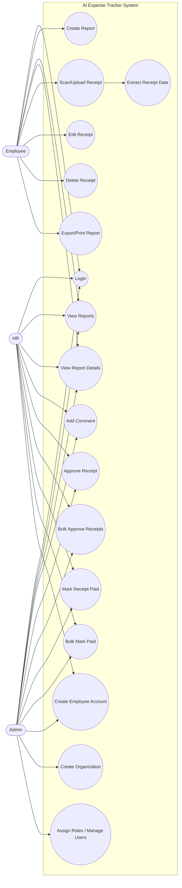
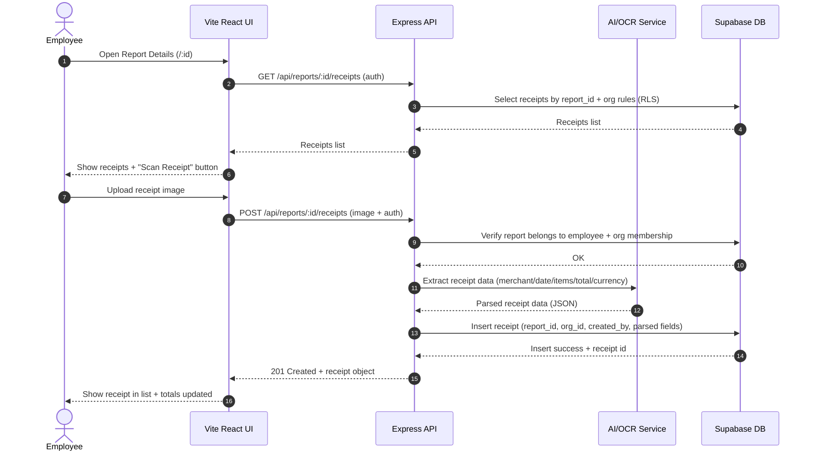
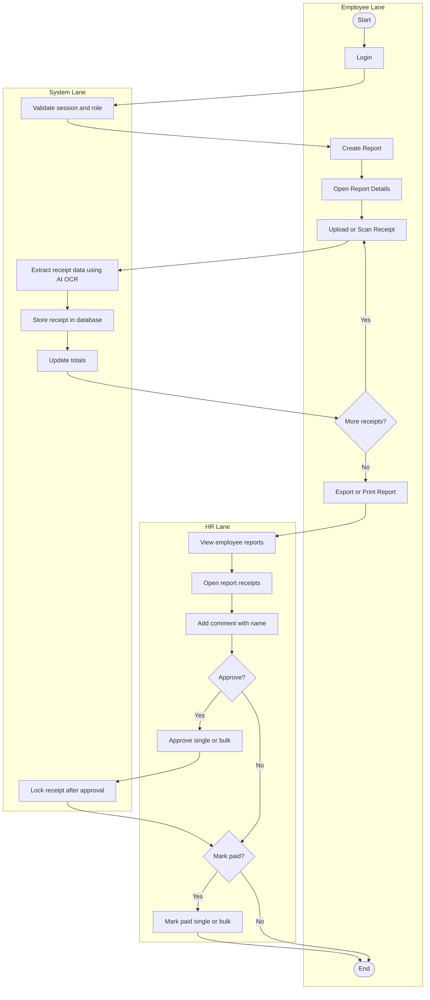
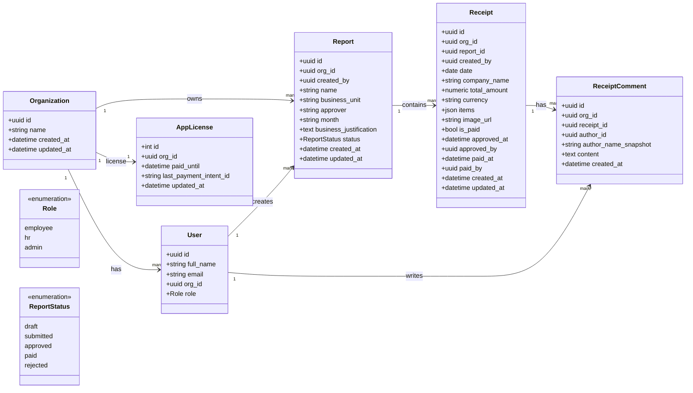

# Assignment No 3: Software Modeling Design (UML)
## Project Topic: AI Expense Tracker for Employee Reimbursement

**System Summary:**  
The AI Expense Tracker helps organizations manage employee expense reimbursements. Employees create **reports** and scan/upload receipts **inside a report only**. The system extracts receipt data (date, merchant, items, total, currency) and stores it. HR reviews, comments, approves, and marks receipts paid (one-by-one or bulk). Admin oversees everything and can manage organizations and users.

**Actors (Users):**
- **Employee**: creates reports, adds/scans receipts in own reports, exports/prints own report
- **HR**: reviews org employees’ reports/receipts, comments, approves, marks paid, creates employees
- **Admin**: everything HR can do + creates organizations + creates users + assigns roles

---

# 1) Use Case Diagram
> Mermaid does not have a dedicated UML use case syntax everywhere, so we represent it cleanly using a flowchart layout (standard in many submissions).

## 2) Sequence Diagram (Employee scans receipt inside a report)

> Scenario: Employee opens a report, uploads a receipt, system extracts data, stores receipt.

# 3) Activity Diagram (Swimlane) — End-to-end reimbursement flow

> Swimlanes are represented using Mermaid subgraphs (lanes).

# 4) Class Diagram (Core domain model)

> This class diagram focuses on entities and relationships.

